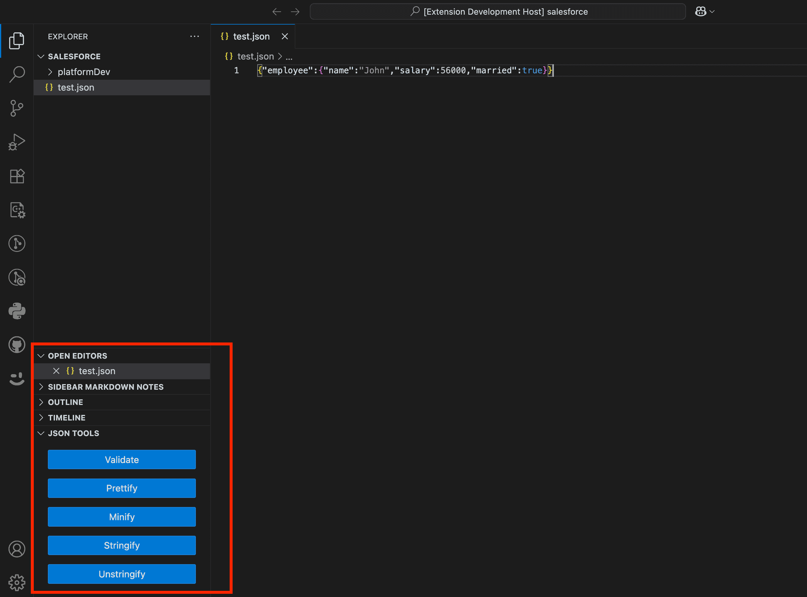

# Ethical JSON Tools

A Visual Studio Code extension that provides a set of tools to work with JSON data ethically and efficiently.

## Features

This extension provides a set of commands to help you work with JSON data. You can access these commands from the "JSON Tools" view in the Explorer sidebar.

### JSON Actions

*   **Validate**: Checks if the selected text or the entire file is valid JSON.
*   **Prettify**: Formats the selected JSON or the entire file with standard indentation.
*   **Minify**: Compresses the selected JSON or the entire file into a single line.

### String Actions

These commands are useful when you have JSON data embedded inside a string literal in your code.

*   **Stringify**: Takes a block of JSON text and converts it into an escaped, single-line string literal.
*   **Unstringify**: Takes a string literal containing JSON and replaces it with the formatted, "un-escaped" JSON content.

## Usage

1.  Open the Explorer sidebar in VS Code.
2.  Find the "JSON Tools" view.
3.  Click on the action you want to perform.
4.  The commands will operate on your current selection. If no text is selected, they will operate on the entire active file.

## Command Reference

This extension provides the following commands, which can be accessed through the Command Palette (Ctrl+Shift+P or Cmd+Shift+P):

| Command | Description |
| --- | --- |
| `ethical-json-tools.validate` | Validate |
| `ethical-json-tools.prettify` | Prettify |
| `ethical-json-tools.minify` | Minify |
| `ethical-json-tools.stringify` | Stringify |
| `ethical-json-tools.unstringify` | Unstringify |

## Contributing

Contributions are welcome! Please feel free to open an issue or submit a pull request.

## Release Notes

### 0.0.1

Initial release of Ethical JSON Tools with the following features:
- Validate JSON
- Prettify JSON
- Minify JSON
- Stringify JSON
- Unstringify JSON

---

**Enjoy using Ethical JSON Tools!**